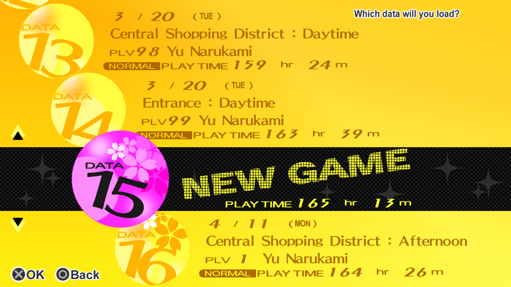
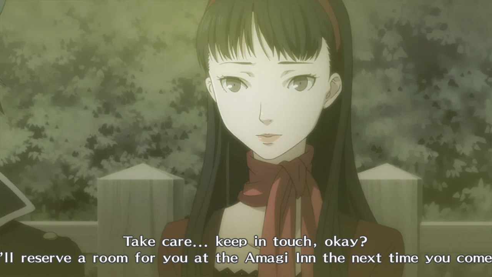
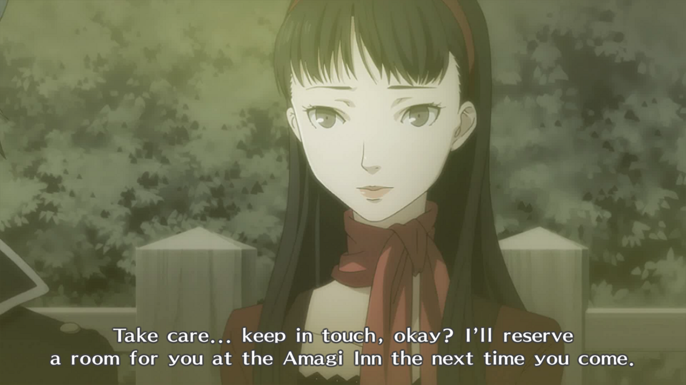
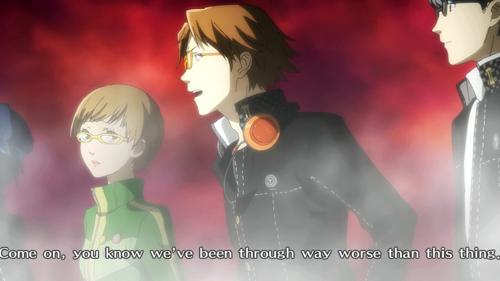
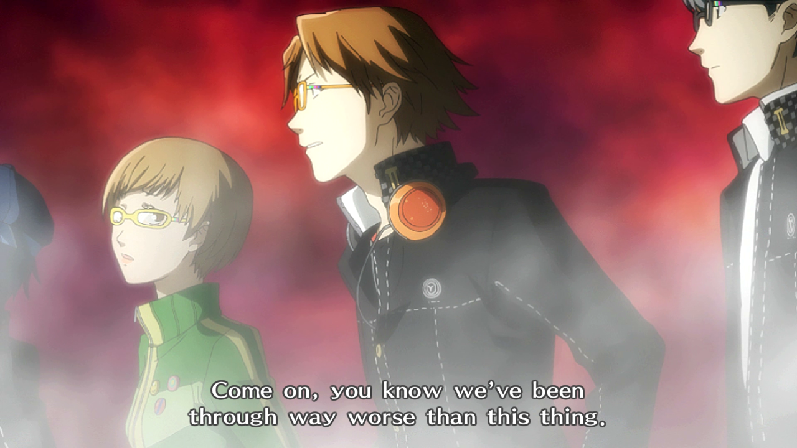

# P4G PC Tiny Fixes

Various tiny fixes for Persona 4 Golden (Steam).

## Requirements

- [Reloaded II](https://github.com/Reloaded-Project/Reloaded-II/releases) - by Sewer56
- [Persona 4 Golden](https://store.steampowered.com/app/1113000/) - game version shouldn't matter (unless some future version fixes these issues :))

## Usage

1. Download Reloaded II.
2. Download and extract the latest release of this mod to `<Reloaded-II Path>/Mods/`.
3. Run Reloaded II.
4. Via the Reloaded II sidebar:
    1. Select *Add an Application*, add `P4G.exe`.
    2. Select *Download Mods*, download `reloaded.universal.steamhook`.
    3. Select *Manage Mods*, select *Steam Hook* and enable `P4G.exe`.
5. Select the P4G icon in the sidebar and enable *Steam Hook* and *Persona 4 Golden PC Tiny Fixes*.
6. Select *Launch Application* to start the game and load the mod.
7. Optionally, select *Create Shortcut* to create a desktop shortcut that will launch the game via Reloaded II automatically.

## Included Fixes

### NG+ Save Slot Fix

Fixes a bug which causes Clear Data and New Game+ saves to appear incorrectly in menus.

This fix should work for all versions of the game (Japanese, English, Korean and Chinese).

| Original           | Fixed                  |
|:------------------:|:----------------------:|
|  |  |

### Subtitle Fixes

Adjusts some English subtitles to fix cutoff issues with the **in-game** versions of some movies (these issues don't occur in the *TV Listings* section due to different subtitle scaling).

| Original           | Fixed                  |
|:------------------:|:----------------------:|
|  |  |
|  |  |
